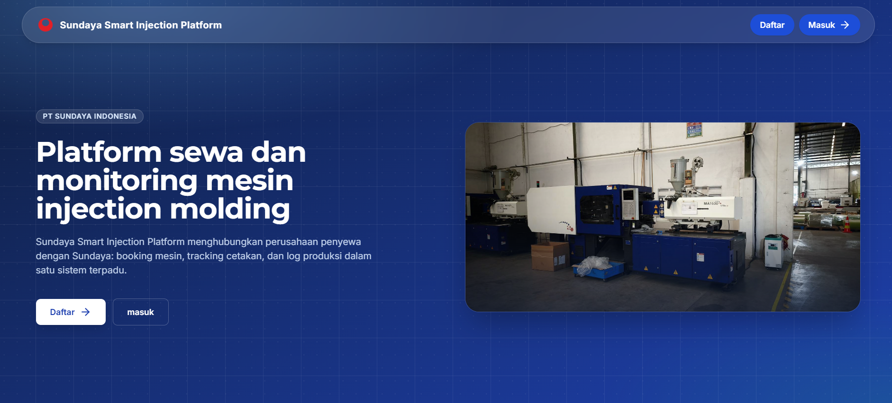

# SSIP - Sundaya Smart Injection Platform



SSIP adalah platform digital dari PT Sundaya Indonesia, penyedia jasa sewa mesin injection molding. Sundaya tidak hanya menyewakan mesin, tapi juga menyediakan sistem digital sebagai media kolaborasi dengan Penyewa, yaitu perusahaan yang menyewa mesin tersebut. Sistem ini single-provider, penyedianya hanya Sundaya, sementara sisi yang jamak adalah Penyewa: banyak perusahaan penyewa dengan data yang terisolasi masing-masing (tenant per perusahaan penyewa).

Entitas utama sistem adalah Production Job. Satu Booking menghasilkan satu Production Job yang bisa memuat beberapa cetakan sekaligus, dan menjadi pusat seluruh transaksi mulai dari booking, mold tracking, operasional mesin, log produksi, material, sampai laporan akhir.

Mesin tidak pernah keluar secara fisik dari Sundaya: tidak ada langkah kirim atau kembalikan mesin. Yang berpindah dan dilacak adalah cetakan (mold). Yang manual di seluruh alur hanya approve/reject booking dan Send Back oleh Admin Sundaya, plus konfirmasi cetakan diterima kembali oleh Manager Penyewa per cetakan. Sisanya bergerak otomatis dari event domain (Log Pengiriman, Log Penerimaan, Log Produksi).

## Dual layer manufacturing information system

Prinsip inti yang tidak boleh dilanggar saat menambah fitur baru: ada dua jenis data yang terpisah dan tidak boleh dicampur.

| | Layer 1: Operational Data | Layer 2: Log Produksi |
|---|---|---|
| Diinput oleh | Teknisi Sundaya | Admin Penyewa (berada di lokasi Sundaya) |
| Sifat data | Real time | Event log / timeline |
| Contoh field | Setup, Running, Cycle Time | Good, Reject, Material terpakai, progress molding |
| Aturan hapus | Tidak boleh dihapus, hanya dikoreksi lewat event baru | Append-only, koreksi lewat event baru, bukan hapus data |
| Menghasilkan | Availability, Performance, Utilization, MTBF, MTTR | Quality, Production Report, Material Report, Customer Dashboard |

Detail lengkap prinsip ini, termasuk cara OEE dihitung lintas layer, ada di [PROJECT_CONTEXT.md](PROJECT_CONTEXT.md) bagian 2.

## Peran pengguna

Sistem ini punya lima role:

- **SUPER_ADMIN**, mengelola akun dan konfigurasi sistem.
- **ADMIN_SUNDAYA**, mengelola booking, mesin, cetakan, dan proses approval.
- **TEKNISI_SUNDAYA**, menginput data operasional mesin real time (Layer 1).
- **MANAGER_PENYEWA**, mengelola booking dan approval sisi Penyewa, termasuk konfirmasi cetakan diterima kembali.
- **ADMIN_PENYEWA**, anak dari Manager Penyewa, menginput log produksi harian di lokasi Sundaya (Layer 2).

Detail lengkap alur proses dan aturan tiap role ada di [PROJECT_CONTEXT.md](PROJECT_CONTEXT.md) dan [docs/ssip-spec.md](docs/ssip-spec.md).

## Arsitektur teknis

Proyek ini disusun sebagai monorepo pnpm dengan tiga bagian:

```
apps/api          Backend NestJS + Prisma (PostgreSQL)
apps/web          Frontend Vite + React + TypeScript + Tailwind CSS
packages/shared   Tipe, DTO, dan enum bersama (@mold-tracker/shared)
docs/             Dokumentasi teknis dan kontrak API
```

`apps/api` adalah backend NestJS dengan Prisma sebagai ORM ke PostgreSQL. Semua route diawali `/api`, dan file upload seperti avatar disajikan lewat `/api/uploads`. Transisi status (mold tracking, job lifecycle, machine status) hanya lewat service layer, tidak pernah langsung dari controller atau query mentah.

`apps/web` adalah frontend React dengan Vite, memakai React Router untuk routing dan Recharts untuk visualisasi data. Tiap role punya dashboard read-only masing-masing, aksi ditempatkan di tab terpisah.

`packages/shared` berisi tipe dan DTO yang dipakai bersama oleh `apps/api` dan `apps/web`, supaya kontrak data antara frontend dan backend tetap konsisten, tidak diduplikasi di kedua sisi.

Database PostgreSQL dijalankan lewat Docker Compose, terikat ke `127.0.0.1` saja sehingga tidak pernah terekspos ke jaringan luar container-nya sendiri.

RBAC diterapkan lewat Guard di setiap endpoint, kecuali yang ditandai publik di kontrak API.

## Menjalankan secara lokal untuk pengembangan

Prasyarat: Node.js 20 ke atas dan pnpm 9.

```bash
pnpm install
cp .env.example apps/api/.env
cp apps/web/.env.example apps/web/.env
docker compose up -d
cd apps/api && pnpm exec prisma migrate dev && cd ../..
pnpm dev
```

Perintah `pnpm dev` menjalankan `apps/api` dan `apps/web` sekaligus dalam mode watch. Frontend memakai proxy dev Vite ke `/api`, sehingga tidak perlu setting `VITE_API_URL` secara manual di tahap ini.

Perintah lain yang sering dipakai:

```bash
pnpm --filter @mold-tracker/api dev          # dev API saja (port 3000, prefix /api)
pnpm --filter @mold-tracker/web dev          # dev web saja (port 5173)
pnpm --filter @mold-tracker/shared build     # build shared (wajib sebelum dev per app pertama kali)
pnpm --filter @mold-tracker/api prisma:migrate   # prisma migrate dev
pnpm --filter @mold-tracker/api seed         # seed database
pnpm lint                                    # lint semua package
pnpm test                                    # test semua package
```

## Environment variables

Backend membaca variabelnya dari `apps/api/.env`.

| Variabel | Kegunaan |
|---|---|
| `DATABASE_URL` | Connection string PostgreSQL, defaultnya cocok dengan kredensial di `docker-compose.yml` |
| `JWT_SECRET` | Secret untuk menandatangani token JWT, harus diisi nilai acak yang panjang, jangan pakai placeholder bawaan |
| `PORT` | Port tempat NestJS berjalan, default 3000 |
| `CORS_ORIGIN` | Origin yang diizinkan memanggil API langsung, tidak relevan kalau frontend dan API disajikan satu origin lewat nginx |
| `EFFICIENCY_THRESHOLD` | Ambang efisiensi dalam persen untuk flagging masalah mesin, default 85 kalau kosong |

Frontend membaca variabelnya dari `apps/web/.env`.

| Variabel | Kegunaan |
|---|---|
| `VITE_API_URL` | Diisi `/api` kalau frontend dan backend satu origin lewat reverse proxy, atau URL penuh backend kalau keduanya beda origin |

## Akun awal (seed)

Menjalankan `pnpm run seed` di `apps/api` akan membuat akun awal untuk tiap role, semuanya memakai password `password123`. Ganti password ini sebelum sistem dipakai sungguhan oleh pengguna nyata.

## Deploy ke jaringan lokal (LAN)

Untuk dipakai beberapa orang lewat jaringan lokal yang sama, misalnya di lingkungan produksi Sundaya, proyek ini dirancang untuk di-deploy ke Raspberry Pi dengan susunan berikut. Nginx berjalan sebagai satu-satunya pintu masuk di port 80, menyajikan hasil build React secara statis dari `apps/web/dist` dan meneruskan semua permintaan yang diawali `/api` ke backend NestJS yang berjalan di port 3000. Karena frontend dan API disajikan dari satu origin yang sama, urusan CORS antar origin tidak relevan. Postgres berjalan di container Docker, tetap terikat ke `127.0.0.1` saja. Backend NestJS dijalankan sebagai service systemd supaya otomatis restart kalau crash dan otomatis hidup lagi setelah Pi reboot.

Kode aplikasi ditaruh di `/var/www/ssip`, bukan di direktori home pengguna. Direktori home di Debian tertutup rapat secara default untuk user lain, sementara nginx berjalan sebagai user `www-data`, sehingga kalau kode ditaruh di `~/nama-user/ssip` nginx akan gagal membaca filenya dengan error permission denied begitu diakses dari perangkat lain, walau semuanya terlihat baik-baik saja saat diakses langsung dari Pi-nya. Direktori `/var/www` sebaliknya memang dirancang terbuka untuk konten yang disajikan web server.

Ringkasan langkahnya:

```bash
# 1. Prasyarat: Node.js 22, pnpm lewat corepack, nginx, git, Docker
curl -fsSL https://deb.nodesource.com/setup_22.x | sudo bash -
sudo apt install -y nodejs nginx git
sudo corepack enable && corepack prepare pnpm@9 --activate

# 2. Clone ke /var/www/ssip, dimiliki user non-root supaya tidak perlu sudo tiap hari
sudo mkdir -p /var/www/ssip && sudo chown -R $USER:$USER /var/www/ssip
git clone <url-repo-github-anda> /var/www/ssip
cd /var/www/ssip

# 3. Install, environment, database
pnpm install
cp .env.example apps/api/.env      # isi JWT_SECRET dan CORS_ORIGIN
cp apps/web/.env.example apps/web/.env
docker compose up -d
cd apps/api && pnpm exec prisma migrate deploy && pnpm run seed && cd /var/www/ssip

# 4. Build lalu jalankan API sebagai service systemd (unit file ExecStart=node dist/main.js)
pnpm build
sudo systemctl enable --now ssip-api

# 5. Nginx menyajikan apps/web/dist dan proxy /api/ ke 127.0.0.1:3000
sudo ln -s /etc/nginx/sites-available/ssip /etc/nginx/sites-enabled/ssip
sudo systemctl reload nginx
```

Untuk memperbarui aplikasi di kemudian hari:

```bash
cd /var/www/ssip
git pull
pnpm install
pnpm build
cd apps/api && pnpm exec prisma migrate deploy && cd /var/www/ssip
sudo systemctl restart ssip-api
```

Nginx tidak perlu di-restart di langkah update, karena dia hanya menyajikan apa pun yang ada di `apps/web/dist` saat itu.

Perangkat lain di jaringan yang sama mengakses lewat `http://<ip-raspberry-pi>/`. IP dari DHCP bisa berubah, jadi sebaiknya buat reservasi IP statis untuk Pi ini di halaman admin router, atau pasang `avahi-daemon` supaya bisa diakses lewat `http://raspberrypi.local/` tanpa perlu tahu IP-nya.

## Dokumentasi lain

- [PROJECT_CONTEXT.md](PROJECT_CONTEXT.md), konteks bisnis dan aturan domain lengkap.
- [docs/ssip-spec.md](docs/ssip-spec.md), spec teknis: schema Prisma, state machine, matriks RBAC.
- [docs/api-contract.md](docs/api-contract.md), kontrak API, sumber kebenaran seluruh endpoint backend.
- [docs/ssip-tasks.md](docs/ssip-tasks.md), pemecahan task pengembangan.
- [CLAUDE.md](CLAUDE.md), panduan kerja untuk asisten AI di repo ini, termasuk aturan tim dan aturan commit.

## Kontribusi

Pesan commit memakai Conventional Commits berbahasa Indonesia: `tipe(scope): ringkasan`, misalnya `feat(web): jumlah mesin di booking`. Detail lengkap ada di [CLAUDE.md](CLAUDE.md) bagian Aturan commit. Aktifkan hook validasi pesan commit sekali per clone:

```bash
git config core.hooksPath .githooks
```
